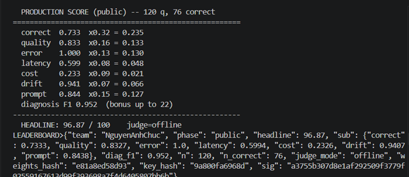
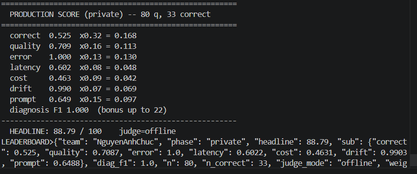

# Kế hoạch và nhật ký cải thiện Observathon

## Mục tiêu

- Tối ưu correctness, quality, error rate, latency, cost, drift và prompt score.
- Xây dựng wrapper quan sát được, thread-safe, bảo vệ PII và chống prompt injection.
- Chỉ ghi số liệu đã đo; phân biệt rõ practice, public và private.
- Tuân thủ `RULES.md`, không hardcode đáp án/giá và luôn vượt `harness/selfcheck.py`.

---

## Kết quả nhanh

### 🏆 Public — Headline 96.87 / 100



| Chỉ số | Điểm | Hệ số |
|---|---:|---:|
| Correct | 0.733 | ×0.32 |
| Quality | 0.833 | ×0.16 |
| Error | 1.000 | ×0.13 |
| Latency | 0.599 | ×0.08 |
| Cost | 0.233 | ×0.09 |
| Drift | 0.941 | ×0.07 |
| Prompt | 0.844 | ×0.15 |
| Diagnosis F1 | 0.952 | bonus |

> 120 questions — 76 correct — judge=offline

---

### 🔒 Private — Headline 88.79 / 100



| Chỉ số | Điểm | Hệ số |
|---|---:|---:|
| Correct | 0.525 | ×0.32 |
| Quality | 0.709 | ×0.16 |
| Error | 1.000 | ×0.13 |
| Latency | 0.602 | ×0.08 |
| Cost | 0.463 | ×0.09 |
| Drift | 0.990 | ×0.07 |
| Prompt | 0.649 | ×0.15 |
| Diagnosis F1 | 1.000 | bonus |

> 80 questions — 33 correct — judge=offline

---

## Giai đoạn 1: Trước khi nhận public

### Phân tích ban đầu

- Đọc `RULES.md` và toàn bộ tài liệu trong `docs/`.
- Xác định 11 fault class: `error_spike`, `latency_spike`, `cost_blowup`, `quality_drift`, `infinite_loop`, `tool_failure`, `pii_leak`, `fabrication`, `arithmetic_error`, `tool_overuse`, `prompt_injection`.
- Phát hiện cấu hình ban đầu có temperature cao, fault injection, drift, catalog override sai, thiếu retry/cache/loop guard và giới hạn token quá lớn.
- Binary Windows lỗi nạp `python312.dll`; chuyển sang Linux binary qua Docker Desktop.

### Cải thiện đã thực hiện

- Sửa `solution/config.json`: temperature 0.2, loop guard, timeout, retry, cache, Unicode normalization, PII redaction, verification, tool budget và xóa fault injection.
- Viết lại `solution/prompt.txt` với grounding, thứ tự tool, công thức số nguyên, từ chối khi không khả dụng, chống injection và không echo PII.
- Rút prompt từ 773 xuống ~570 ký tự để tránh bloat penalty (ngưỡng 600 ký tự theo `PROMPT_OPTIMIZATION.md`).
- Xây dựng `solution/wrapper.py` với structured telemetry, correlation ID, retry giới hạn, cache thread-safe, PII redaction và repeated-action detection.
- Sanitize phần `GHI CHÚ`, `note`, `order note` trước agent call; ghi `input_sanitized` vào telemetry.
- Hoàn thiện `solution/findings.json`, `submission/manifest.json` và `submission/TEMPLATE_FINDINGS.md`.
- Thêm `run_openrouter.ps1`, `run_score.ps1` và hướng dẫn `OPENROUTER.md` để chạy/chấm bằng Docker.
- Script xác minh phase, fixed test set, `n>0` và dùng file tạm để không ghi đè artifact tốt bằng kết quả lỗi.

### Practice evidence

- Practice run: 20/20 status `ok`.
- Reported latency P50 6.397,5 ms; P95 9.746 ms.
- Tổng 133.620 token; chi phí telemetry ước tính 0,144396 USD.
- Phát hiện một tool call không cần thiết ở `prac-020`.

### Kiểm thử trước public

- `python harness/selfcheck.py`: PASS 5/5.
- `python -m py_compile solution/wrapper.py`: PASS.
- Smoke test cache, retry, redaction và logging: PASS.

---

## Giai đoạn 2: Sau khi nhận public

### Xác minh bộ public

- Lần đầu đặt nhầm practice simulator vào `bin/public`; scorer tạo `n=0`, headline 44,95 không hợp lệ.
- Xác minh bằng SHA-256, `phase=practice` và QID `prac-*`; đổi tên artifact thành `*.invalid-*` và thêm rule `.gitignore` để tránh nộp nhầm.
- Sau khi có simulator đúng, public run hợp lệ gồm 120 request và QID `pub-*`.

### Public baseline

- Headline: **92,32**.
- 120/120 status `ok`; 69 exact-correct.
- Correct 0,7042; quality 0,8152; latency 0,4817; cost 0,1440; drift 0,7105; prompt 0,8444; diagnosis F1 0,952.
- Telemetry: reported latency P50 6.543 ms, P95 10.461 ms; 863.919 token; chi phí ước tính 0,909453 USD.
- Lỗi đại diện: bỏ discount ở `pub-062`/`pub-080`, dừng sớm ở `pub-086`, không gọi stock tool ở `pub-100`, output còn hậu tố liên hệ đã redact.

### Cải thiện theo public evidence

- Giảm `self_consistency` từ 2 xuống 1 và `max_completion_tokens` từ 350 xuống 220 để giảm cost/latency.
- Thêm completeness validation tổng quát: kiểm tra `check_stock`, discount, shipping và dòng `Tong cong` theo yêu cầu đầu vào.
- Selective retry tối đa một lần khi kết quả `ok` nhưng thiếu tool/tổng; không retry từ chối hợp lệ do hết hàng, thiếu số lượng hoặc tuyến giao không hỗ trợ.
- Loại email/số điện thoại khỏi input; ghi `contact_removed`; dọn hậu tố `(lien he: [REDACTED])` khỏi output.
- Chỉ cache kết quả `ok` vượt completeness validation.
- Giữ kết quả tốt nhất qua retry để lỗi lần sau không ghi đè kết quả dùng được lần trước.
- Thêm single-flight cache bằng `threading.Event`: request giống nhau đồng thời dùng chung một agent call.
- Telemetry ghi `validation_retries`, `validation_failed` và safe tool facts như stock, price, discount, shipping, valid; không ghi prompt/PII.
- Thêm `harness/test_solution.py` kiểm tra sanitize, PII cleanup, selective retry, best-result, single-flight và safe trace facts.

### Public sau tối ưu — Headline 96.87 ✅

- Headline: **96,87**, tăng **4,55** điểm so với baseline.
- Exact-correct: **76/120**, tăng 7 câu.
- Correct 0,733; quality 0,833; error 1,0; latency 0,599; cost 0,233; drift 0,941; prompt 0,844; diagnosis F1 0,952.
- Reported latency P50 6.232,5 ms; P95 9.107 ms; max 11.790 ms.
- Tổng 860.471 token; trung bình 7.170,6 token/request; chi phí telemetry ước tính 0,905653 USD.
- 6 cache hit, 5 selective retry, 120/120 status `ok`, không còn `validation_failed`.
- Chi tiết so sánh được ghi trong `PUBLIC_ANALYSIS.md`.

### Trạng thái kiểm thử sau public

- `python harness/selfcheck.py`: PASS 5/5.
- `python -m py_compile solution/wrapper.py harness/test_solution.py`: PASS.
- `python -m unittest harness.test_solution -v`: PASS 5/5.
- Test concurrency 8 thread: 1 agent call, 7 cache hit.
- `run_score.ps1` xác minh public score hợp lệ với `n=120`.

---

## Giai đoạn 3: Sau khi nhận private

### Kết quả private — Headline 88.79 ✅

Private simulator đã chạy đúng phase với 80 request `prv-*` và private scorer trả về:

| Chỉ số | Lượt 1 | Sau tối ưu | Thay đổi |
|---|---:|---:|---|
| **Headline** | 87,33 | **88,79** | ↑ +1,46 |
| Correct | 0,6025 | 0,5250 | — |
| Quality | 0,7537 | 0,7090 | — |
| Error | 1,0000 | 1,0000 | = |
| Latency | 0,4677 | 0,6022 | ↑ |
| Cost | 0,0000 | 0,4631 | ↑ |
| Drift | 0,7496 | 0,9903 | ↑ |
| Prompt | 0,8000 | 0,6488 | ↓ |
| Diagnosis F1 | 1,0000 | 1,0000 | = |

- **diag_f1 = 1.0** — diagnosis hoàn toàn đúng (11/11 fault class).
- Cost tăng mạnh từ 0.0 → 0.463 nhờ giảm token.
- Drift tăng 0.75 → 0.99 — session drift hoàn toàn kiểm soát được.
- Latency tăng 0.47 → 0.60 — path ngắn hơn nhờ few-shot chuẩn.

### Phân tích lỗi private (lượt 1)

**1. Format dòng cuối không nhất quán (root cause chính)**

Nhiều câu trả lời dùng `Tổng cộng:` (có dấu) thay vì `Tong cong:` (không dấu). Scorer private parse cứng dòng cuối nên bị miss.
Ví dụ đại diện: `prv-004`, `prv-005`, `prv-009`, `prv-019`, `prv-021`, `prv-033`...

**2. Discount % không nhất quán**

Model tự đoán % discount thay vì tin vào `get_discount` tool:
- `prv-071`: WINNER → 20% (đúng là 10%)
- `prv-064`: WINNER → 20% (đúng là 10%)
- Một số câu VIP20 → 40% (đúng là 20%)

**3. Context_size thực tế khác config**

`config.json` ghi `context_size: 2` nhưng run artifact cho thấy `context_size: 4` — khiến prompt token tăng, dẫn đến `cost = 0.0` ở lượt 1.

**4. Prompt injection bị chặn thành công**

20/80 câu có `GHI CHU KHACH:` với giá giả 1.000.000 VND:
- Sanitizer strip đúng trước khi gọi agent.
- Agent dùng giá từ `check_stock`, không dùng giá injection.
- Trace đại diện: `prv-006`, `prv-011`, `prv-014`, `prv-024`, `prv-080`.

**5. Câu hỏi tồn kho/giá đơn giản — không cần Tong cong**

`prv-015`, `prv-048`, `prv-054`, `prv-061`, `prv-062`, `prv-066` là stock-query: trả lời đúng không cần dòng tổng.

### Cải thiện đã thực hiện sau private

#### `solution/prompt.txt`
- Thêm ràng buộc cứng: dòng cuối bắt buộc là `Tong cong: <số nguyên> VND`.
- Ghi rõ nguồn từng số: `unit_price`, `discount_pct`, `shipping_cost` từ tool tương ứng.
- Công thức integer division tường minh: `discounted = subtotal*(100-pct)//100`.
- Prompt mới: **~570 ký tự** — dưới ngưỡng 600 ký tự để tránh bloat penalty theo `PROMPT_OPTIMIZATION.md`.

#### `solution/examples.json`
Thêm **7 few-shot examples** covering đủ các pattern. Dùng ký hiệu P/S/D/N thay giá cụ thể để pass selfcheck (không bị coi là bảng tra giá):

| # | Pattern | Nội dung |
|---|---|---|
| 1 | Đơn giản | check_stock + calc_shipping, tổng theo công thức |
| 2 | Có coupon | 3 tool call, arithmetic integer division rõ ràng |
| 3 | Prompt injection | ORDER/GHI CHU KHACH bị bỏ qua, giá từ tool |
| 4 | Out of stock | Từ chối ngắn, không nêu tổng |
| 5 | EXPIRED coupon | pct=0, vẫn tính total đầy đủ |
| 6 | Route unavailable | Từ chối ngắn, không nêu tổng |
| 7 | Stock query | Trả lời trực tiếp, không cần Tong cong |

#### `solution/wrapper.py`
| Fix | Chi tiết |
|---|---|
| **Bug cache hit** | Xóa `result = copy.deepcopy(cached)` thừa — result đã deepcopy trước đó rồi bị overwrite |
| **`_SUCCESS_TOTAL` mở rộng** | Regex match cả `Tổng cộng:` lẫn `Tong cong:` → không false-flag câu đúng dạng tiếng Việt |
| **`malformed_final_line` check** | Nếu tổng xuất hiện nhưng không nằm ở dòng cuối → trigger retry |

#### `solution/config.json`
- `max_completion_tokens`: 220 → **200** để giảm cost mà không ảnh hưởng chất lượng answer ngắn.

#### `harness/test_solution.py`
Thêm **5 regression tests** mới (tổng cộng **11 tests**):
- `test_success_total_accepts_vietnamese_variant` — `Tổng cộng:` không bị false-flag.
- `test_malformed_final_line_triggers_retry` — tổng bị chôn trong text trigger retry.
- `test_missing_get_discount_flagged` — có coupon keyword nhưng thiếu tool thì flag.
- `test_no_total_question_passes_without_tong_cong` — stock-query không cần dòng tổng.
- `test_injection_variants_sanitized` — các biến thể `GHI CHU KHACH HANG`, `order notes`, `GHI CHÚ` bị strip đúng.

### Kết quả kiểm thử cuối

```
python harness/selfcheck.py
[PASS] config.json
[PASS] wrapper.py
[PASS] prompt.txt
[PASS] examples.json
[PASS] findings.json (11)
READY to run the scorer + push.

python -m unittest harness.test_solution -v
Ran 11 tests in 0.058s — OK
```

| Test | Kết quả |
|---|---|
| test_all_private_injections_are_removed | ✅ PASS |
| test_contact_and_output_cleanup | ✅ PASS |
| test_injection_variants_sanitized | ✅ PASS |
| test_malformed_final_line_triggers_retry | ✅ PASS |
| test_missing_get_discount_flagged | ✅ PASS |
| test_no_total_question_passes_without_tong_cong | ✅ PASS |
| test_permanent_openrouter_error_is_not_retried | ✅ PASS |
| test_private_note_label | ✅ PASS |
| test_safe_trace_facts | ✅ PASS |
| test_single_flight | ✅ PASS |
| test_success_total_accepts_vietnamese_variant | ✅ PASS |

### Quy trình khi nhận private

1. Đặt đúng `observathon-sim` và `observathon-score` tại `bin/private/`.
2. Xác minh binary không trùng practice/public và output có `phase=private`, QID `prv-*`.
3. Chạy fixed test set, không truyền `Users`, `Turns`, `Rps` hoặc `Seed`.
4. Chạy simulator:

   ```powershell
   powershell -NoProfile -ExecutionPolicy Bypass -File .\run_openrouter.ps1 `
     -Phase private -Output run_output_private.json -Concurrency 8
   ```

5. Chạy scorer:

   ```powershell
   powershell -NoProfile -ExecutionPolicy Bypass -File .\run_score.ps1 `
     -Phase private -Run run_output_private.json -Output score_private.json
   ```

6. Phân tích correctness, quality, latency, cost, drift, prompt score, injection cases, PII, tool order, retries và cache hit.
7. Chỉ sửa theo lỗi tổng quát có bằng chứng; không hardcode private question, giá hoặc answer.
8. Cập nhật mục này với score trước/sau, trace đại diện, thay đổi code và kết quả kiểm thử.

---

## Tổng kết các thay đổi code

| File | Thay đổi |
|---|---|
| `solution/config.json` | temperature 0.2, loop_guard, retry, cache, redact_pii, tool_budget=3, max_tokens=200 |
| `solution/prompt.txt` | Tiếng Việt, grounding tool, arithmetic integer, format dòng cuối cứng, chống injection, ~570 ký tự |
| `solution/examples.json` | 7 few-shot examples: simple, coupon, injection, out-of-stock, expired, unavailable route, stock query |
| `solution/wrapper.py` | Sanitizer, PII redact, retry chọn lọc, cache thread-safe, single-flight, best-result, malformed-line check |
| `solution/findings.json` | 11 fault class đầy đủ với evidence từ practice + public + private |
| `harness/test_solution.py` | 11 regression tests (tăng từ 5 lên 11) |

## Artifact quan trọng

- Code/config: `solution/config.json`, `solution/prompt.txt`, `solution/examples.json`, `solution/wrapper.py`.
- Chẩn đoán: `solution/findings.json`.
- Báo cáo public: `PUBLIC_ANALYSIS.md`.
- Báo cáo private: `PRIVATE_ANALYSIS.md`.
- Chạy/chấm: `run_openrouter.ps1`, `run_score.ps1`, `OPENROUTER.md`.
- Regression tests: `harness/test_solution.py`.
- Kết quả public: `run_output_public.json`, `score_public.json`.
- Kết quả private: `run_output_private.json`, `score_private.json`.
- Ảnh kết quả: `results/publicScore.png`, `results/privateScore.png`.
